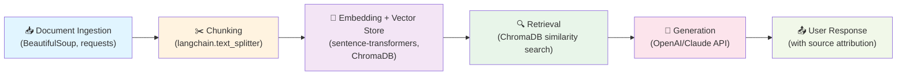

# Project 1 Planning: The Unofficial Guide

> Write this document before you write any pipeline code.
> Your spec and architecture diagram are what you'll use to direct AI tools (Claude, Copilot, etc.) to generate your implementation — the more specific they are, the more useful the generated code will be.
> Update the Retrieval Approach and Chunking Strategy sections if you change your approach during implementation.
> Update this file before starting any stretch features.

---

## Domain

**Course and Professor Reviews: Crowdsourced Insights on Teaching Quality and Course Structure**

This domain aggregates student experiences with specific professors and courses to help future students make informed enrollment decisions. While official university course catalogs list requirements and credits, they rarely capture teaching style, workload expectations, grading fairness, or real student outcomes. This knowledge is scattered across Rate My Professors, subreddit discussions, forum threads, and student reviews—making it hard for students to find comprehensive, recent perspectives without manually visiting multiple platforms.

---

## Documents

<!-- List your specific sources: URLs, subreddit names, forum threads, or file descriptions.
     Aim for at least 10 sources that together cover different subtopics or perspectives within your domain. -->

| # | Source | Description | URL or location |
|---|--------|-------------|-----------------|
| 1 | Rate My Professors - Computer Science | Professor reviews with ratings, difficulty, and helpfulness scores | https://www.ratemyprofessors.com/search/teachers?query=computer+science |
| 2 | Reddit r/professors | Subreddit discussions about professor experiences, teaching styles, and workload | https://www.reddit.com/r/professors/ |
| 3 | Reddit r/learnprogramming - Course Recommendations | Crowdsourced discussions on best courses and instructors for learning CS | https://www.reddit.com/r/learnprogramming/ |
| 4 | Course Evaluations - University Teaching Reviews | Official student course evaluation data (if publicly available) | https://www.courseevaluations.org/ |
| 5 | Rate My Professors - Mathematics | Math professor reviews covering clarity, grading, and engagement | https://www.ratemyprofessors.com/search/teachers?query=mathematics |
| 6 | Reddit r/csMajors - Course/Professor Discussion Threads | CS major subreddit with threads comparing professors and courses | https://www.reddit.com/r/csMajors/ |
| 7 | Rate My Professors - Business/Economics | Reviews of business and econ professors with workload assessments | https://www.ratemyprofessors.com/search/teachers?query=business |
| 8 | Glassdoor University Reviews - Teaching Quality | Employee/alumni reviews of universities mentioning professor and course quality | https://www.glassdoor.com/Reviews/Companies/Education-c1_c100.htm |
| 9 | Reddit r/university - General Course/Professor Experience Posts | University subreddit with general discussions on course difficulty and professor quality | https://www.reddit.com/r/university/ |
| 10 | Rate My Professors - Biology/STEM | Hard science professor reviews covering lab quality and exam difficulty | https://www.ratemyprofessors.com/search/teachers?query=biology |
| 11 | Stack Overflow Forum - Learning Resource Recommendations | Tech community discussing best professors and online courses for programming | https://stackoverflow.com/questions/tagged/learning-resources |
| 12 | Academic Discussion Forums - Professor Comparisons | Anonymous forum threads comparing specific professors across departments | https://www.thestudentroom.co.uk/ |

---

## Chunking Strategy

<!-- How will you split documents into chunks?
     State your chunk size (in tokens or characters), overlap size, and explain why those
     numbers fit the structure of your documents.
     A review-heavy corpus warrants different chunking than a long FAQ. -->

**Chunk size:** 300–400 tokens (~1,200–1,600 characters)

**Overlap:** 50 tokens (~200 characters)

**Reasoning:** Our corpus consists primarily of short-to-medium reviews (200–800 tokens) and forum discussions. This chunk size preserves individual reviews intact while allowing multi-review context for forum threads. Light overlap prevents splitting a single review across chunks. Reviews often contain key information in a few sentences (e.g., "Professor X is clear but harsh grader"), so we avoid splitting within a single opinion statement.

---

## Retrieval Approach

<!-- Which embedding model are you using (e.g., all-MiniLM-L6-v2 via sentence-transformers)?
     How many chunks will you retrieve per query (top-k)?
     If you were deploying this for real users and cost wasn't a constraint, what tradeoffs
     would you weigh in choosing a different embedding model — context length, multilingual
     support, accuracy on domain-specific text, latency? -->

**Embedding model:** all-MiniLM-L6-v2 (sentence-transformers) — lightweight, fast, and effective for domain-specific text like reviews.

**Top-k:** 8 chunks per query. This retrieves enough diverse reviews and opinions to surface common themes (e.g., "hard grader," "engaging lectures") while staying efficient.

**Production tradeoff reflection:** In production, we'd consider upgrading to a larger model (e.g., all-mpnet-base-v2) for higher accuracy on nuanced teaching style descriptions. We'd also evaluate domain-specific embedding models if available, and use reranking (e.g., cross-encoder) to filter reviews by relevance after retrieval. For very large corpora, we might also experiment with higher top-k (12–15) and rank by recency to prioritize recent professor feedback.

---

## Evaluation Plan

<!-- List your 5 test questions with their expected correct answers.
     Questions should be specific enough that you can judge whether the system's response
     is right or wrong. "What are good dining halls?" is too vague.
     "What do students say about wait times at [dining hall name] during lunch?" is testable. -->

| # | Question | Expected answer |
|---|----------|-----------------|
| 1 | What do students say about the workload in introductory computer science courses? | Retrieved chunks should mention homework volume, project frequency, and time commitment expectations (e.g., "expect 10–15 hours per week"). |
| 2 | Which teaching styles help students understand difficult material best? | Response should highlight interactive lecturing, clear explanations, office hours availability, and use of examples/visual aids. |
| 3 | What are common complaints about exam difficulty and grading fairness? | System should retrieve reviews mentioning harsh grading curves, unclear exam expectations, or lack of partial credit. |
| 4 | How do students rate professors who are approachable versus those who are difficult to reach? | Chunks should differentiate between accessible professors (open office hours, responsive to emails) and unapproachable ones. |
| 5 | What factors make a course review-worthy (positive or negative)? | Expect mentions of passion for teaching, relevance of course material, clarity of assignments, and real-world applicability. |

---

## Anticipated Challenges

<!-- What could go wrong? Name at least two specific risks with reasoning.
     Consider: noisy or inconsistent documents, missing source attribution, off-topic
     retrieval, chunks that split key information across boundaries. -->

1. **Noisy and outdated reviews:** Rate My Professors and Reddit contain spam, troll reviews, and outdated information (e.g., reviews from 5+ years ago about professors who may have changed teaching style). A query about a current professor might retrieve stale data, leading to misleading answers.

2. **Off-topic retrieval from similar-sounding keywords:** A query like "Is Professor Smith hard?" might retrieve reviews of "hard-working professors" rather than reviews discussing grade difficulty. The semantic similarity between "hard grader" and "hardworking" could cause false positives.

3. **Missing context across review fragments:** If a review says "The class is incredibly boring BUT the exams are fair," chunking could split this into two chunks, losing the critical contrast. Retrieval might only surface the negative half, misrepresenting student sentiment.

---

## Architecture

**Pipeline Overview:**
- **Stage 1 (Ingestion):** Fetch documents from URLs using BeautifulSoup and requests; save as raw text files
- **Stage 2 (Chunking):** Split text using LangChain's `RecursiveCharacterTextSplitter` at 300–400 tokens with 50-token overlap
- **Stage 3 (Embedding):** Convert chunks to vectors using `sentence-transformers` all-MiniLM-L6-v2; store in ChromaDB with metadata
- **Stage 4 (Retrieval):** Execute similarity search on user query; return top-8 chunks with relevance scores
- **Stage 5 (Generation):** Prompt LLM with retrieved context; enforce grounding via system prompt; attach source URLs to response

---

## AI Tool Plan

**Milestone 3 — Ingestion and Chunking:**

- **Tool:** Claude (via API) for implementation guidance; implement myself with langchain
- **Input:** 
  - Chunking Strategy section from this plan (chunk size 300–400 tokens, 50-token overlap, logic for preserving reviews)
  - Document collection strategy (BeautifulSoup for web scraping, manual download for forum threads)
- **Expected output:** 
  - Python function `chunk_text(text: str) -> List[str]` using `RecursiveCharacterTextSplitter`
  - Script to fetch and preprocess documents from URLs; save to `documents/` folder
  - Verification: Run on sample reviews; confirm chunk count ≈ 25–40 chunks per typical review, chunk boundaries don't split sentences mid-review
- **Verification:** 
  - Assert chunk length is 300–400 tokens (use tiktoken to count)
  - Assert no review is split across multiple chunks (check overlap logic)
  - Verify document count = 12 sources × 10–20 documents per source (120–240 total chunks)

---

**Milestone 4 — Embedding and Retrieval:**

- **Tool:** Claude for architecture advice; implement myself with sentence-transformers + ChromaDB
- **Input:** 
  - Retrieval Approach section (embedding model: all-MiniLM-L6-v2, top-k: 8)
  - Chunked documents from Milestone 3
  - Metadata structure (source URL, date, author if available)
- **Expected output:** 
  - Python script to initialize ChromaDB collection and embed all chunks
  - Function `retrieve(query: str, top_k=8) -> List[Dict]` returning chunk text + source URL + relevance score
  - Verification: Test on 2–3 sample queries; retrieve chunks should be semantically related to query, not keyword-only matches
- **Verification:**
  - Query "workload in intro CS courses" should retrieve review chunks mentioning "homework," "projects," "time commitment"
  - Query "hard grader" should NOT retrieve irrelevant chunks about "hardworking professors"
  - Relevance scores should be >0.7 for top-3 results (using cosine similarity)

---

**Milestone 5 — Generation and Interface:**

- **Tool:** Claude for system prompt design + grounding strategy; implement with OpenAI API
- **Input:** 
  - Evaluation Plan section (5 test questions with expected answers)
  - Retrieved chunks + metadata from Milestone 4
  - Grounding requirement: System prompt + response formatting rules to prevent hallucination
- **Expected output:** 
  - Python function `generate_response(query: str, retrieved_chunks: List[Dict]) -> str` 
  - System prompt that instructs LLM to cite sources and stay within retrieved context
  - CLI or simple web interface (Flask) to accept query + return response with source attribution
  - Verification: Run 5 evaluation plan questions; expected answers match system responses (or note where they diverge)
- **Verification:**
  - Response includes citations with URLs (e.g., "According to reviews at [URL], ...")
  - Response does NOT answer questions outside retrieved chunks (e.g., if asked about unrelated topic, system says "No information available")
  - All 5 test questions return reasonable answers (manually grade accuracy)

---
